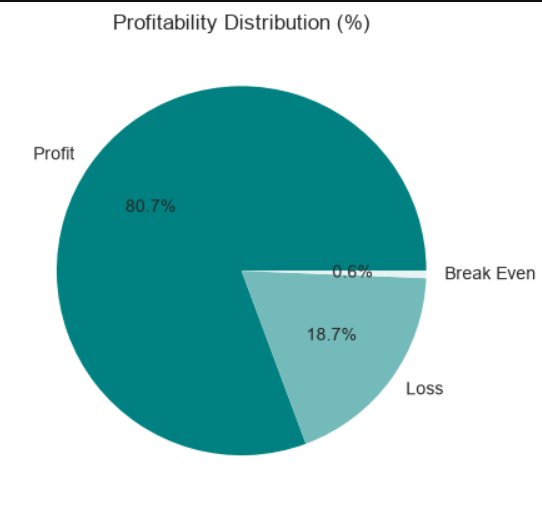
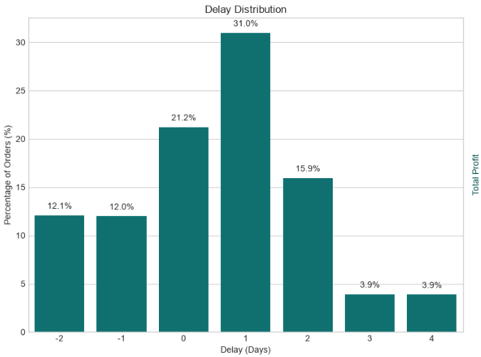
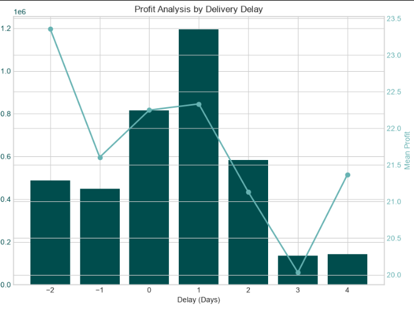
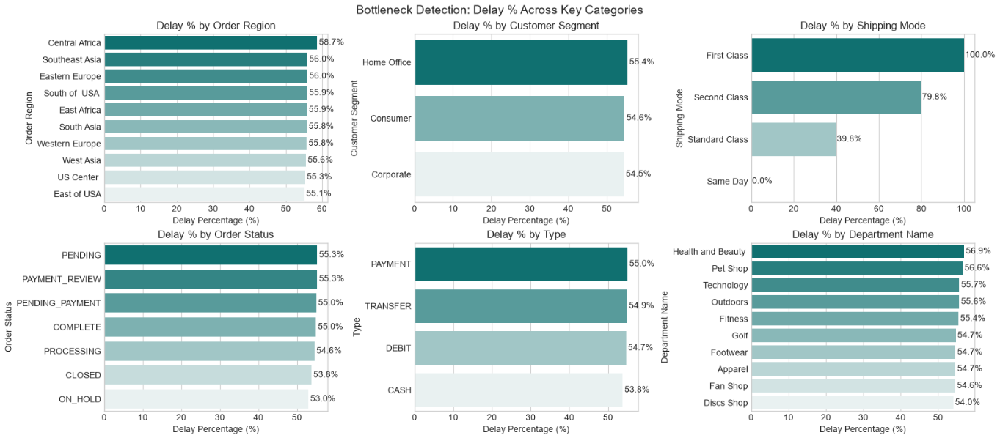
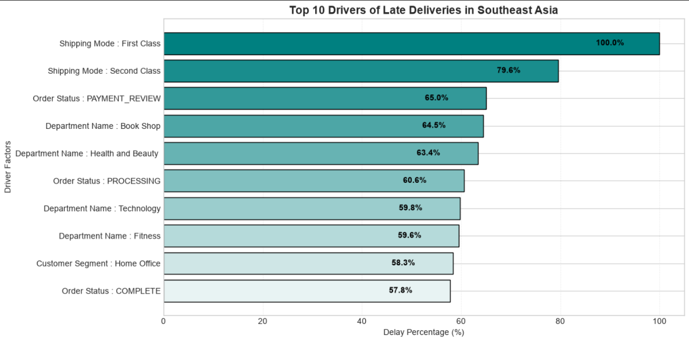
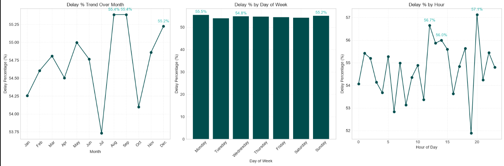

# 🚚 Supply Chain Delivery Delay Analysis

An end-to-end Data Analytics project focused on identifying the key factors responsible for delivery delays in a supply chain and providing actionable business recommendations using Python.

---

## 📌 Project Overview

Late deliveries negatively impact customer satisfaction, operational efficiency, and profitability. This project analyzes a real-world supply chain dataset to uncover the root causes of delivery delays through exploratory data analysis, feature engineering, KPI reporting, and business-driven visualizations.

The goal is to answer one key business question:

> **Why are products being delivered late, and what operational insights can help reduce delivery delays?**

---

## 🎯 Business Objectives

- Understand the overall delivery performance of the supply chain.
- Measure the impact of delivery delays on profitability.
- Identify operational bottlenecks causing late deliveries.
- Discover the major drivers behind delayed shipments.
- Analyze delay patterns across different time periods.
- Provide data-driven recommendations for improving supply chain performance.

---

## 📂 Dataset

This project uses the [DataCo Smart Supply Chain Dataset](https://www.kaggle.com/code/binayakbishnu/datacosupplychaindataset/notebook) available on Kaggle.

> **Note:** The dataset is not included in this repository due to licensing restrictions.

You can download it from Kaggle and place it in your local project directory before running the notebook.

---

## 🛠️ Tools & Technologies

- Python
- Pandas
- NumPy
- Matplotlib
- Seaborn
- Jupyter Notebook

---

## 📊 Project Workflow

### 1. Business Understanding
- Understanding the supply chain process
- Defining the business problem
- Identifying analysis objectives

### 2. Data Preparation
- Data inspection
- Handling missing values
- Removing unnecessary columns
- Data cleaning

### 3. Feature Engineering

Created new features including:

- Order Processing Time
- Delivery Delay
- Is Delayed Flag
- Profitability Flag
- Order Month
- Order Day
- Order Hour

---

## 📈 Key Performance Indicators (KPIs)

- Total Orders
- Late Deliveries
- Late Delivery Percentage
- On-Time Delivery Percentage
- Total Profit
- Profit at Risk
- 90th Percentile Delivery Delay

---

## 📊 Analysis Performed

### Profitability Analysis
- Profitability Distribution
- Delay Distribution
- Profit vs Delivery Delay

### Bottleneck Detection
Analyzed delivery delay percentages across:
- Order Region
- Customer Segment
- Shipping Mode
- Department Name
- Order Status
- Order Type

### Root Cause Analysis
Identified the top operational drivers contributing to delivery delays for selected regions.

### Time-Based Analysis
Analyzed delivery delay trends by:
- Month
- Day of Week
- Hour of Day

---

## 🔍 Key Insights

- More than **54% of orders were delivered late**, indicating a significant supply chain challenge.
- Delivery delays were observed across almost every operational category, suggesting a system-wide issue rather than isolated bottlenecks.
- Shipping Mode, Department, Region, and Order Status emerged as key contributors to delayed deliveries.
- Orders delivered earlier or on time generally generated higher profits than delayed orders.
- Time-based analysis showed only minor seasonal variation, indicating operational factors had a greater influence on delays than calendar-based patterns.

---

## 💡 Strategic Recommendations

- Improve end-to-end supply chain coordination to reduce delivery delays.
- Focus operational improvements on high-delay departments and regions.
- Optimize shipping mode selection and logistics planning.
- Track Order Processing Time as an operational KPI.
- Monitor delivery performance through an interactive KPI dashboard.
- Continuously review regional logistics performance to identify recurring bottlenecks.

---

## 📷 Sample Visualizations

This project includes visualizations such as:

### Profitability Distribution

---

### Delay Distribution

---

### Profit vs Delivery Delay

---

### Bottleneck Detection

---

### Root Cause Analysis

---

### Time-Based Delay Analysis

---

## 🚀 Learning Outcomes

Through this project, I strengthened my skills in:

- Exploratory Data Analysis (EDA)
- Data Cleaning
- Feature Engineering
- Business KPI Development
- Data Visualization
- Business Storytelling
- Root Cause Analysis
- Supply Chain Analytics

---

## 👩‍💻 About Me

Hi, I'm **Rohini Wagh**.

I'm an aspiring **Data Analyst** passionate about transforming raw data into actionable business insights through analytics and visualization.

I'm currently building real-world data projects while continuously improving my skills in Python, SQL, Excel, and Power BI.

Feel free to connect with me on LinkedIn!

---

⭐ If you found this project interesting, consider giving this repository a star!
